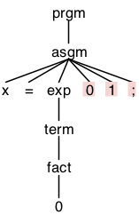
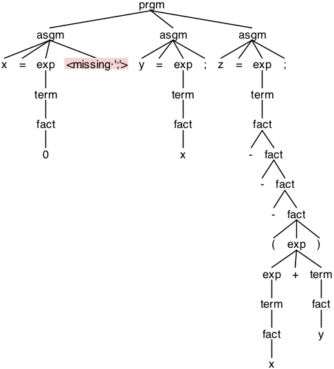

# CISC 7120X Programming Languages and Compilers
## Term Project

- **Instructor:** [Prof. Neng-Fa Zhou](http://www.sci.brooklyn.cuny.edu/%7Ezhou/)
- **Student:** Evrim Cabuk
- [Assignment Page](http://www.sci.brooklyn.cuny.edu/~zhou/teaching/cis7120/project.html)

### Requirements

- [Python 3](https://www.python.org)
  - [antlr4-python3-runtime](https://pypi.org/project/antlr4-python3-runtime/)
  - [virtualenv](https://virtualenv.pypa.io/en/latest/) *(optional)*
- [antlr](http://www.antlr.org/download.html) *(optional)*
- GNU Make *(optional)*

### Build

```bash
virtualenv venv
source venv/bin/activate
pip install -r requirements.txt
make build
```

### Run
```bash
python3 main.py <INPUT_FILE>
```


### Tests

##### Test 1

*Input:*
```text
x = 001;
```

*Parse Tree:*



*Output:*
```text
line 1:5 mismatched input '0' expecting ';'
x = 0
```


##### Test 2

*Input:*
```text
x_2 = 0;
```

*Parse Tree:*


*Output:*
```text
x_2 = 0
```


##### Test 3

*Input:*
```text
x = 0
y = x;
z = ---(x+y);
```

*Parse Tree:*



*Output:*
```text
line 2:0 missing ';' at 'y'
x = 0
y = 0
z = 0
```


##### Test 4

*Input:*
```text
x = 1;
y = 2;
z = ---(x+y)*(x+-y);
```

*Parse Tree:*


*Output:*
```text
x = 1
y = 2
z = 3
```


#### Test 5
*Input:*
```text
x = 1;
y = t+2;
```

*Parse Tree:*


*Output:*
```text
x = 1
Exception: Unassigned variable `t.`
```